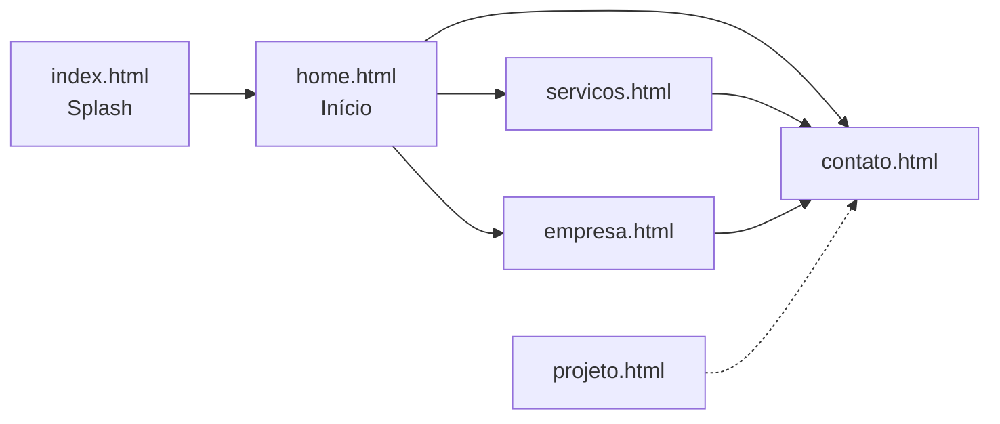

# NEXUS — Design System

Documento de referência visual e técnica do site institucional **NEXUS Technology Systems**. Use este arquivo ao criar novas páginas, ajustar componentes ou manter consistência entre telas.

---

## 1. Visão geral

| Item | Valor |
|------|--------|
| **Marca** | NEXUS |
| **Tagline** | Tecnologia Sob Medida |
| **Posicionamento** | Sistemas personalizados, IA, automação e integração para empresas |
| **Idioma** | Português (pt-BR) |
| **Tom visual** | Premium, escuro, metálico — “liquid silver” sobre fundos graphite/onyx |

### Fluxo do site



- **`index.html`**: landing de entrada (sem navbar/footer); CTA leva a `home.html`.
- **Demais páginas**: usam `components.js` para injetar navbar e footer.

---

## 2. Identidade visual

### 2.1 Conceito

- **Dark-first**: fundos quase pretos com camadas de superfície (`surface`, `surface-container-*`).
- **Prata líquida**: gradientes claros em títulos, botões primários e destaques.
- **Glassmorphism**: painéis com `backdrop-filter: blur` e bordas `white/5`–`white/20`.
- **Imagens**: preferencialmente em escala de cinza, alto contraste (`grayscale`, `contrast-125`, classe `.silver-nitrate-img` na home).

### 2.2 Paleta canônica (recomendada)

Consolidar gradualmente as variações por página para estes tokens:

| Token | Hex | Uso |
|-------|-----|-----|
| `onyx-black` | `#000000` | Fundo mais profundo (empresa, projeto) |
| `background` | `#050505` – `#0a0a0a` | Base geral |
| `surface` | `#0e0e0e` – `#131313` | Corpo da página |
| `surface-container-low` | `#121212` | Seções alternadas |
| `surface-container` | `#181818` | Cards, blocos |
| `surface-container-high` | `#1a1a1a` – `#222222` | Hover, CTA sections |
| `graphite` | `#111111` | Seções empresa |
| `primary` / `bright-silver` | `#E5E4E2` – `#E8E8E8` | Texto de destaque, CTAs |
| `polished-silver` / `silver` | `#C0C0C0` | Texto secundário forte |
| `on-surface` | `#E5E2E3` – `#F5F5F5` | Texto principal |
| `on-surface-variant` | `#999999` – `#A0A0A0` | Parágrafos, legendas |
| `outline` / `outline-variant` | `#707070` – `#444444` | Bordas, divisores |

### 2.3 Gradientes

```css
/* CTA primário — usar em botões "Começar Agora", "Falar com Especialista" */
.cta-gradient,
.bg-premium-gradient {
  background: linear-gradient(135deg, #ffffff 0%, #a8a8a8 50%, #444444 100%);
}

/* Texto metálico */
.liquid-silver-text,
.silver-gradient-text {
  background: linear-gradient(180deg, #ffffff 0%, #999999 100%);
  -webkit-background-clip: text;
  -webkit-text-fill-color: transparent;
  background-clip: text;
}

/* Prata empresa/serviços */
.silver-gradient {
  background: linear-gradient(135deg, #E5E4E2 0%, #8A8D8F 100%);
}
```

### 2.4 Tipografia

| Papel | Família | Peso | Uso |
|-------|---------|------|-----|
| **Display / Logo** | Inter ou Noto Serif | 300–400, `tracking-[0.18em]`–`[0.3em]` | Wordmark "NEXUS" |
| **Headline** | Noto Serif (serviços, empresa, contato) ou Inter (home) | 400–700, itálico em destaques | H1–H2 |
| **Body** | Manrope ou Inter | 300–400 | Parágrafos |
| **Label** | Manrope / Inter | 600–700, `text-[10px]`–`text-xs`, `uppercase`, `tracking-widest` | Eyebrows, badges, botões |

**Google Fonts (padrão interno):**

- Inter: `100–900` (splash `index.html`, `home.html`)
- Noto Serif + Manrope: páginas internas
- Material Symbols Outlined: ícones

### 2.5 Espaçamento e layout

- **Container**: `max-w-[1440px]` ou `max-w-[1920px]`, padding horizontal `px-8` / `px-12` / `lg:px-16`.
- **Seções verticais**: `py-32` ou `py-40` entre blocos principais.
- **Navbar fixa**: `pt-20`–`pt-32` no `<main>` para compensar altura.
- **Grid de cards**: `grid-cols-1 md:grid-cols-2 lg:grid-cols-4` ou layout assimétrico `md:col-span-8` + `md:col-span-4`.

### 2.6 Bordas e raios

| Elemento | Classe Tailwind |
|----------|-----------------|
| Cards | `rounded-xl` |
| Botões CTA | `rounded-full` |
| Inputs | `border-b` apenas (sem caixa) |
| Badges / tags | `rounded-full`, `px-4 py-1` |

---

## 3. Componentes

### 3.1 Navbar (`components/navbar.html`)

- Fixa no topo: `fixed top-0 w-full z-50 glass-nav`.
- Logo: link para `home.html`, serif, `tracking-[0.25em]`.
- Links: `nav-link` + `data-page` (valor igual ao `data-page` do `<body>`).
- CTA: `bg-premium-gradient`, texto preto, `rounded-full`.
- Estado ativo: aplicado por `components.js` (classe `nav-active` + bolinha inferior).

**Páginas e `data-page`:**

| Arquivo | `data-page` |
|---------|-------------|
| `home.html` | `home` |
| `servicos.html` | `servicos` |
| `empresa.html` | `empresa` |
| `contato.html` | `contato` |
| `projeto.html` | `projeto` (se usar navbar) |

### 3.2 Footer (`components/footer.html`)

- `border-t border-white/5`, fundo preto.
- Colunas: identidade + links (Plataforma / Conectar).
- E-mail: `nexussystemscore.dev@gmail.com`

### 3.3 Botões

| Tipo | Estilo |
|------|--------|
| **Primário** | Gradiente prata, texto preto, `rounded-full`, `text-xs`, `tracking-[0.2em]`, `uppercase` |
| **Secundário** | `border border-outline-variant`, hover `bg-surface-container-high` |
| **Ghost / link** | Texto branco/prata + ícone `arrow_forward` com `group-hover:translate-x-1` |

Interações comuns: `hover:brightness-110`, `active:scale-95`, `transition-all duration-300`.

### 3.4 Cards

- **Glass card** (serviços): `.glass-card` — fundo semi-transparente, borda sutil, hover mais claro.
- **Feature card** (home): `bg-surface-container-low`, `border border-white/5`, ícone em círculo branco.
- **Stat block**: número grande `text-3xl` + label `text-[10px] uppercase tracking-widest`.

### 3.5 Formulário (contato)

- Painel: `.glass-panel` + `.silver-glow`.
- Labels: `text-[10px] font-bold uppercase tracking-widest text-silver`.
- Inputs: `bg-transparent`, `border-b border-outline-variant`, focus `border-bright-silver`.
- Submit: estilo link com ícone, não botão sólido.

### 3.6 Eyebrows / tags

```html
<span class="inline-block px-4 py-1 rounded-full bg-white/10 border border-white/20
  text-white text-[10px] font-bold tracking-[0.2em] uppercase">
  INTELIGÊNCIA ARTIFICIAL
</span>
```

Palavras-chave recorrentes: **VISÃO**, **INTELIGÊNCIA**, **IA E AUTOMAÇÃO**, **AUTOMAÇÃO**, **SISTEMAS**, **INTEGRAÇÃO**.

### 3.7 Ícones

- Biblioteca: [Material Symbols Outlined](https://fonts.google.com/icons).
- Tamanhos: `text-3xl` em cards, `text-4xl` em destaques.
- Ícones usados: `neurology`, `shield_lock`, `speed`, `robot_2`, `strategy`, `analytics`, `check_circle`, `arrow_forward`, `north_east`, etc.

---

## 4. Páginas

### 4.1 `index.html` (splash)

- CSS inline (sem Tailwind).
- Fundo `#131313`, logo com gradiente, glows em blur.
- Não usa `components.js`.

### 4.2 `home.html`

- Hero full-screen com `img/robohome.png` + `.silver-nitrate-img`.
- Seções: soluções em grid assimétrico, quote do CEO, métricas (100%, Alta eficiência).
- Tailwind + tokens Material-like (`surface`, `on-surface`, etc.).

### 4.3 `servicos.html`

- Hero com imagem externa (Google CDN).
- Grid 4 colunas de serviços com offset `lg:mt-12`.
- Faixa de logos parceiros + CTA final em card grande.

### 4.4 `empresa.html`

- Split header texto/imagem.
- Missão, visão, valores em cards `bg-onyx-black`.
- Seção cultura com imagens full-height.

### 4.5 `contato.html`

- Formulário + sidebar (endereço São Roque, SP; telefone; e-mail).
- Cards “Nosso Ecossistema” (Desenvolvimento, Integração, Infraestrutura).

### 4.6 `projeto.html`

- Página de case/detalhe de projeto (template).
- Mesma linguagem visual que empresa (onyx + prata).

---

## 5. Arquitetura técnica

```
nexushub/
├── index.html          # Splash (entrada)
├── home.html
├── servicos.html
├── empresa.html
├── contato.html
├── projeto.html
├── components.js       # Loader de partials
├── components/
│   ├── navbar.html
│   ├── footer.html
│   └── header.html     # (reservado / legado)
├── img/                # Assets locais
│   ├── favicon.png
│   ├── iconelogo.png
│   ├── robohome.png
│   └── logoexplodido.png
└── design.md           # Este arquivo
```

### 5.1 Stack

- HTML estático
- [Tailwind CSS](https://tailwindcss.com) via CDN (`?plugins=forms,container-queries`)
- JavaScript vanilla (`components.js`) para componentes compartilhados
- Deploy alvo: GitHub Pages ou servidor estático

### 5.2 Adicionar uma nova página

1. Criar `nova-pagina.html` com estrutura padrão (`<html class="dark" lang="pt-BR">`).
2. Incluir Tailwind, fonts, `components.js` com `defer`.
3. No `<body>`: `data-page="nova-pagina"`.
4. Inserir `<div id="nexus-navbar"></div>` antes do `<main>` e `<div id="nexus-footer"></div>` após.
5. Adicionar link em `components/navbar.html` com `data-page="nova-pagina"`.
6. Reutilizar tokens e classes deste documento.

### 5.3 `components.js` — comportamento

- Lê `document.body.dataset.page`.
- Faz `fetch` de `components/navbar.html` e `components/footer.html` (caminho relativo à raiz do site).
- Injeta HTML e marca link ativo via `.nav-link[data-page]`.

---

## 6. Assets

| Arquivo | Uso |
|---------|-----|
| `img/favicon.png` | Favicon em todas as páginas |
| `img/iconelogo.png` | Background do splash |
| `img/robohome.png` | Hero da home |
| `img/logoexplodido.png` | Seção “Feito para a sua realidade” |

Imagens externas (Google user content) aparecem em serviços, empresa e contato — preferir migrar para `img/` quando possível.

---

## 7. Acessibilidade e SEO

- `lang="pt-BR"` em todas as páginas.
- `<title>` por página: `{Página} | NEXUS` ou `NEXUS | Tecnologia Sob Medida` no splash.
- `viewport` meta em todas.
- Imagens: sempre `alt` descritivo.
- Contraste: texto principal claro sobre fundo escuro (WCAG AA na maioria dos pares prata/preto).
- Navbar: links reais (`<a href>`), não apenas `div` clicáveis.

---

## 8. Voz e conteúdo

- **Proposta**: tecnologia que se adapta ao negócio, não o contrário.
- **Evitar**: tom genérico de SaaS; preferir “sob medida”, “sua operação”, “processos”.
- **CTAs principais**: “Começar Agora”, “Falar com um Especialista”, “Ver Soluções”.
- **Prova social**: métricas qualitativas (100% personalizado, alta eficiência) — validar números antes de publicar claims quantitativos reais.

---

## 9. Dívida técnica / padronização

Itens a alinhar em refactors futuros:

1. **Tokens duplicados**: cada HTML redefine `tailwind.config` com pequenas diferenças (Inter vs Manrope/Noto Serif).
2. **Extrair CSS compartilhado**: `.glass-nav`, `.glass-panel`, `.cta-gradient` repetidos — candidatos a `styles/nexus.css`.
3. **`index.html` isolado**: não compartilha navbar nem design tokens Tailwind.
4. **`components/header.html`**: vazio — remover ou implementar.
5. **Formulário de contato**: sem backend; integrar serviço (Formspree, Supabase, etc.) quando necessário.
6. **Unificar fonte headline**: Inter na home vs Noto Serif nas demais.

---

## 10. Checklist rápido (nova UI)

- [ ] Fundo escuro (`surface` / `onyx-black`)
- [ ] Título com serif ou `.liquid-silver-text` em destaque
- [ ] Eyebrow uppercase com tracking largo
- [ ] CTA primário em gradiente prata + texto preto
- [ ] Bordas `border-white/5` ou `border-white/10`
- [ ] Imagens hero em grayscale quando fotográficas
- [ ] `data-page` + placeholders navbar/footer
- [ ] Favicon e `lang="pt-BR"`

---

*Última atualização: maio/2026 — reflete o estado atual do repositório nexushub.*
