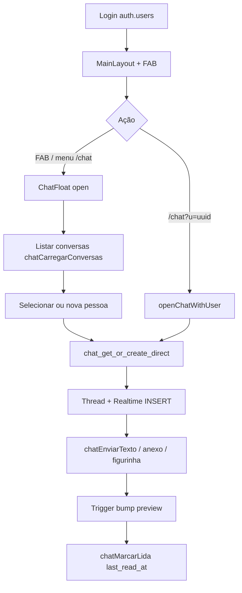

# Auditoria — Chat interno RG Ambiental (fonte da verdade)

Repositório: `C:\dev\rh-ambiental-sistema`  
Deploy: `https://rh-ambiental-sistema.vercel.app`  
Supabase: **projeto próprio do RG** (não é o `nexushub` central).

## Decisão multi-produto (Fase 2)

| Opção | Situação no ecossistema |
|-------|-------------------------|
| **A** — Um Supabase `nexushub` + `system_id` | **Não** — RG e Ligeirinho já persistem chat em BDs separadas. |
| **B** — Supabase por produto | **Sim** — RG: `chat_conversas` / `chat_mensagens`; Ligeirinho: `chat_threads` / `chat_messages`. |
| **C** — Chat nos apps filhos; hub só link | **Sim** — NEXUS Hub não tem módulo de chat; `hub_systems` aponta para cada app. |

Isolamento entre produtos é por **projeto Supabase distinto**, não por coluna `system_id`.

---

## 1. Rotas e navegação

| Item | Detalhe |
|------|---------|
| URL legada | `/chat` — abre o painel flutuante e redireciona (não é página full-screen). |
| Deep link | `/chat?u=<uuid>` — abre conversa com utilizador (`Chat.tsx`). |
| Menu | `src/lib/paginasSistema.ts` — entrada `{ path: '/chat', label: 'Chat' }`. |
| RBAC | `src/lib/nexusCargosPorRota.ts` — `'/chat': [...DASHBOARD_E_CHAT, C.operadoresTimeR]`. |
| App router | `src/App-NEXUS.tsx` (e `App.tsx`) — `Route path="/chat"` com `ProtectedRoute` + cargos. |
| Guard | Mesmo fluxo de auth do produto (`usuarios.status = ativo`). |

**Arquivos:** `src/pages/Chat.tsx`, `src/pages/Chat-NEXUS.tsx`, `src/App-NEXUS.tsx`, `src/lib/paginasSistema.ts`, `src/lib/nexusCargosPorRota.ts`.

---

## 2. Layout (UI)

| Área | Implementação |
|------|----------------|
| Shell | Painel flutuante (portal) — `ChatInternoFloating.tsx` (~1100 linhas). |
| Lista | `ChatSidebarPanel.tsx` — abas **Conversas** / **Pessoas**, busca, preview, hora, badge não lidas. |
| Thread | `ChatThreadPanel.tsx` — histórico, bolhas, anexos, figurinhas. |
| Composer | `ChatComposerPicker.tsx` — texto, anexo, stickers. |
| FAB | Canto da tela, arrastável (`rg-chat-fab-pos-v1`), temas de cabeçalho. |
| Estados | Carregando lista/thread, vazio, erros RLS com mensagem amigável em `chat.ts`. |
| Mobile | Sidebar + thread com painéis lista/detalhe (mesmo padrão conceitual do Ligeirinho `cw-body--mobile`). |
| Extra RG | Coluna **Solicitações** (pedido de ajuste / fila Thaís) — `ChatPedidosAjusteColuna.tsx`, `chatPedidoAjuste.ts`. |

**Arquivos:** `src/components/chat/*`, `src/contexts/ChatFloatContext.tsx`, `src/layouts/MainLayout-NEXUS.tsx` (badge + realtime).

---

## 3. Modelo de dados (Supabase)

### Tabelas principais

| Tabela | Colunas relevantes |
|--------|-------------------|
| `chat_conversas` | `participant_low`, `participant_high` (par único DM), `ultima_preview`, `ultima_em`, `ultima_remetente_id` |
| `chat_participantes` | `conversa_id`, `user_id`, `last_read_at` |
| `chat_mensagens` | `conversa_id`, `remetente_id`, `conteudo`, anexos (`anexo_*`) |

### Migração base

`supabase/migrations/20260411120000_chat_interno.sql`

### RPCs / funções

| Função | Uso |
|--------|-----|
| `chat_get_or_create_direct(p_outro)` | Abrir DM |
| `chat_unread_by_conversa()` | Contagem não lidas por conversa |
| `chat_insert_mensagem` (migrações posteriores) | Insert com RLS seguro |
| `chat_ordered_participant_pair` | Ordenação UUID = PG |

### Triggers

- `trg_chat_mensagens_bump_conversa` — atualiza preview na conversa.

### Storage

- Bucket `chat-anexos` (privado), path `{conversa_id}/...`.

### Realtime

- Publicação `supabase_realtime` em `chat_mensagens`.
- Layout escuta `INSERT` em `chat_mensagens` e `UPDATE` em `chat_participantes` para badge.

### Extensões RG (não obrigatórias no Ligeirinho)

- Stickers: `20260526140000_chat_stickers.sql`
- Pedido ajuste / fila / Thaís: várias migrações `20260526*` … `20260805*`
- Apagar histórico (admin/dev): `chat_admin_apagar_historico_conversa`, etc.

### RLS (resumo)

- SELECT conversas/mensagens só se participante em `chat_participantes`.
- INSERT mensagens: remetente = `auth.uid()` e participante.
- INSERT conversas: **não** direto — só via RPC `chat_get_or_create_direct`.
- Diretório: policy em `usuarios` para listar ativos no chat.

---

## 4. Fluxos

| Fluxo | RG |
|-------|-----|
| Criar conversa | RPC ou fallback insert par low/high |
| Enviar texto | Insert `chat_mensagens` ou RPC `chat_insert_mensagem` |
| Anexos | Upload `chat-anexos` + mensagem com `anexo_path` |
| Editar/apagar msg | Não no fluxo normal; admin apaga **histórico** inteiro |
| Lidas | `chat_participantes.last_read_at` + RPC unread |
| Realtime | Supabase `postgres_changes` na thread ativa + badge no layout |

---

## 5. Participantes

- **Tipo:** apenas DM (`tipo = 'direct'`), 1:1.
- **Grupos / por cliente:** não no schema base.
- **Papéis:** RBAC por rota `/chat`; pedidos de ajuste com workflow (`workflowPermissions.ts`, fila Thaís para aprovador).

---

## 6. API

- **Client Supabase** direto (`src/lib/chat.ts`, `chatStickers.ts`, `chatPedidoAjuste.ts`).
- **Sem** Edge Functions obrigatórias para DM.
- **Sem** rotas Vercel `/api` para chat.

---

## 7. Auth

- `auth.users` + tabela produto `public.usuarios` (status ativo, cargo, foto, presença).
- **Não** usa `hub_profiles` do NEXUS Hub central.
- JWT do projeto Supabase do RG.

---

## 8. Estilo

- CSS global / classes `chat-interno-*` no bundle do RG (tema escuro operacional).
- Componentes: `ChatAvatar`, `RgChatLogo`, gradientes de cabeçalho configuráveis.
- NEXUS Hub central usa outro design system; paridade é **fluxo**, não cópia de CSS entre repos.

---

## 9. Testes manuais (roteiro RG)

1. Login com utilizador ativo (operador ou gestão com `/chat`).
2. Clicar FAB ou ir a `/chat` — painel abre; URL volta para `/bem-vindo`.
3. Aba **Pessoas** → iniciar conversa → enviar texto (Enter).
4. Segundo browser/incógnito com outro utilizador → mensagem aparece em segundos (realtime).
5. Badge FAB incrementa quando há não lidas; abrir thread marca lida.
6. Anexo imagem (se migração storage aplicada).
7. Ctrl+Shift+R após deploy — confirmar bundle novo.

---

## Mapa de arquivos (checklist)

- [x] Rotas: `src/pages/Chat.tsx`, `src/App-NEXUS.tsx`
- [x] UI: `src/components/chat/ChatInternoFloating.tsx`, `ChatSidebarPanel.tsx`, `ChatThreadPanel.tsx`
- [x] Estado global: `src/contexts/ChatFloatContext.tsx`
- [x] Dados: `src/lib/chat.ts`, `src/types/chat.ts`
- [x] SQL: `supabase/migrations/20260411120000_chat_interno.sql` + fixes RLS/realtime
- [x] Integrações: `SolicitarAjusteSistemaFloat.tsx` → `chatEnviarPedidoAjusteSistema`
- [x] Layout badge: `src/layouts/MainLayout-NEXUS.tsx`

---

## Paridade esperada no Ligeirinho Hub

| RG | Ligeirinho (estado) |
|----|---------------------|
| `chat_conversas` | `chat_threads` |
| `chat_mensagens.conteudo` | `chat_messages.body` |
| Preview em coluna na conversa | Preview calculado no client (`listarThreads`) |
| Anexos + stickers | **Não** (só texto no widget) |
| Pedido ajuste / fila Thaís | **Solicitações** via `suporte_tickets` |
| `/chat` + `?u=` | Implementado neste rollout |
| FAB + badge | `ChatLauncher` + `resumoInboxChat` |

Ver `ligeirinhohub/docs/chat-ligeirinho-rollout.md` para o que foi alterado e como testar.

---

## NEXUS Hub central (implementado no app)

- UI: `src/components/chat/HubChatLauncher.tsx`, `HubChatWidget.tsx`
- API: `src/lib/hubChat.ts` → tabelas `hub_chat_*`
- Rota `/chat` + item **Chat** no dock; FAB canto inferior direito
- SQL: `supabase/migrations/20260612120000_hub_chat_interno.sql`
